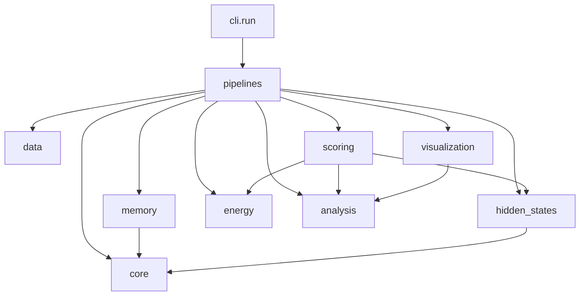
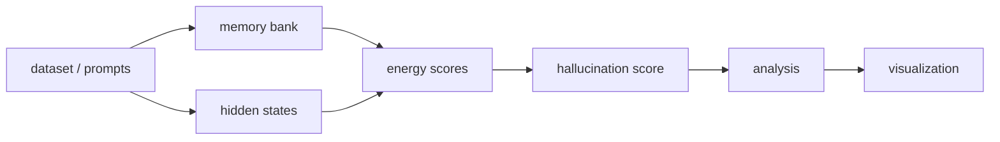

# Architecture

## Module Responsibilities

### `energy_llm.core`
Responsible for model metadata and Hugging Face model loading. This is the only layer that knows how to instantiate Qwen, Mistral, Phi, or Llama models and configure 4-bit loading.

### `energy_llm.data`
Responsible for dataset and prompt ingestion. `truthfulqa.py` normalizes TruthfulQA into a stable sample structure. `prompts.py` loads standalone JSON prompt files for decoupled hidden-state extraction.

### `energy_llm.memory`
Responsible for MLP memory-bank extraction. `mlp_bank.py` reads model MLP projections and converts them into per-layer banks that can be serialized and reused.

### `energy_llm.hidden_states`
Responsible for extracting pooled hidden states from question/answer segments. This layer owns token segmentation, pooling, and serialization-ready hidden-state packaging.

### `energy_llm.energy`
Responsible for Modern Hopfield energy computation. It contains the core layer-wise energy primitive and does not know anything about datasets or experiments.

### `energy_llm.analysis`
Responsible for divergence primitives and score summarization. KL, JS, and Hellinger live here, along with analysis-time aggregation over saved score artifacts.

### `energy_llm.scoring`
Responsible for turning hidden states plus memory banks into layer-wise divergence metrics and scalar hallucination scores. The TruthfulQA baseline experiment also lives here because it is a scoring workflow rather than a model-loading concern.

### `energy_llm.visualization`
Responsible for rendering plots from saved analysis JSON outputs.

### `energy_llm.pipelines`
Responsible for stage orchestration. Each file corresponds to a decoupled runnable stage: build memory, extract hidden states, score, analyze, and visualize.

### `energy_llm.cli`
Responsible for standalone CLI entry points. `run.py` exposes subcommands for each pipeline stage.

### Compatibility Packages
The legacy packages `models`, `datasets`, `representations`, `metrics`, `experiments`, and `energies` are retained as thin compatibility wrappers so old imports keep working while the thesis codebase moves to the cleaner structure above.

## Dependency Graph



## Data Flow



## Pipeline Modes

| Mode | Status | Notes |
|------|--------|-------|
| `build-memory` | Works | `pipelines/build_memory_bank.py` extracts and saves the MLP bank with model metadata. |
| `extract-hidden` | Works | `pipelines/extract_hidden_states.py` loads the saved memory artifact to recover model identity, then extracts and saves hidden states only. |
| `score` | Works | `pipelines/compute_divergences.py` loads saved hidden states and memory banks, computes layer metrics, and saves score artifacts. |
| `analyze` | Works | `pipelines/aggregate_scores.py` loads saved scores and computes dataset-level statistics over saved divergence and score arrays. |
| `visualize` | Works | `pipelines/export_results.py` loads saved analysis JSON and renders plots. |

All five modes are independently runnable and do not require re-running upstream steps if the upstream artifacts are already on disk.

## Modularity Analysis

| Mode | Description | Assessment |
|------|-------------|------------|
| `build-memory` | Run only MLP weight extraction and save the memory bank to disk | Works as implemented. The saved artifact includes model metadata so downstream stages can recover the correct model. |
| `extract-hidden` | Load a saved memory bank + a set of prompts, extract hidden states only | Works as implemented. The memory artifact is used as the model contract; prompts are loaded from JSON. |
| `score` | Load saved hidden states + memory bank, compute Hopfield energy scores | Works as implemented. For paired records it computes divergence metrics plus scalar hallucination scores; for single records it computes per-layer energy profiles. |
| `analyze` | Load saved scores, compute entropy/KL/JS divergences, produce statistics | Works with one caveat: KL/JS and entropy deltas are currently produced in the `score` stage and summarized in `analyze`. No upstream rerun is required because the divergence arrays are serialized in the score artifact. |
| `visualize` | Load saved analysis results, produce all plots and dashboards | Works as implemented via saved analysis JSON. Current outputs are static plots rather than interactive dashboards. |

## Parallelization Analysis

### 1. Stateless and embarrassingly parallel stages

- Prompt-level hidden-state extraction is embarrassingly parallel across samples once the model is loaded.
- Score computation over saved hidden states is embarrassingly parallel across samples once the memory bank is loaded.
- Analysis over saved score rows is largely embarrassingly parallel across categories, labels, or metrics.
- Visualization is mostly independent per plot.

### 2. Stages with dependencies that prevent naive parallelization

- Memory-bank construction depends on a loaded model and must iterate over model layers; it is not naturally split across machines unless layer ownership is coordinated explicitly.
- Hidden-state extraction on a single GPU is constrained by model residency and GPU memory. Naively spawning many processes can oversubscribe VRAM.
- `extract-hidden` depends on `build-memory` only for the saved model contract and artifact compatibility.
- `score` depends on both the memory bank and hidden-state artifacts already existing.
- `analyze` depends on score artifacts and `visualize` depends on analysis outputs.

### 3. Recommended parallelization mechanisms

- Dataset loading and prompt JSON ingestion: `torch.utils.data.DataLoader` with `num_workers` for preprocessing, or async I/O for remote dataset fetches.
  Speedup: low to medium.
- Hidden-state extraction: batched inference on GPU first; if scaling across CPU workers, shard prompt files and launch one GPU-backed process per device rather than many workers per GPU.
  Speedup: high.
- Score computation from saved hidden states: `multiprocessing.Pool` or Slurm array jobs over sample shards because scoring is stateless once artifacts are loaded.
  Speedup: high.
- Analysis summarization: `multiprocessing.Pool` for large score tables, especially for per-category or per-metric reductions.
  Speedup: medium.
- Visualization: one process per plot family if many plots are generated.
  Speedup: low.

### 4. Expected speedup category

- Memory-bank extraction: low.
- Hidden-state extraction: high.
- Score computation: high.
- Analysis summarization: medium.
- Visualization: low.

## Standalone CLI

```bash
python -m energy_llm.cli.run build-memory --model qwen2.5-3b --output memory_bank.pt
python -m energy_llm.cli.run extract-hidden --memory memory_bank.pt --prompts prompts.json --output hidden.pt
python -m energy_llm.cli.run score --memory memory_bank.pt --hidden hidden.pt --output scores.pt
python -m energy_llm.cli.run analyze --scores scores.pt --output analysis.json
python -m energy_llm.cli.run visualize --analysis analysis.json --output plots/
```

## Notes On Placeholder Modules

Many files in `analysis/`, `core/`, `datasets/`, `evaluation/`, `experiments/`, `pipelines/`, and `utils/` were originally empty placeholders. The refactor preserves that research-friendly layout while moving the implemented logic into the modules that now directly support the decoupled thesis pipeline.
